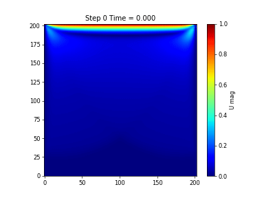
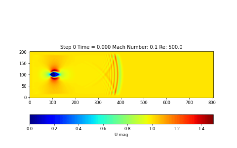

# PDE_Module
PDE_Module is a fun little side project I am doing to help better understand GPU based simulations and my frustrations with trying to use open source/research implementations.

It is a pytorch inspired framework (namely `torch.nn`) but instead aimed for quickly developing simulations and allowing easy changes while maintaining speed.

From a high level simulations turn out to be very similar to Deep Learning networks in that many simulations are really just a composing of several differential terms (such as laplacian and divergence) together.

# Why Warp?

There are lots of DSL's availiable such as CuPy, taichi, pytorch and so on but warp has the following advantages:
- unlike cupy, users write python code that is turned into Cuda code instead of simply writing cuda code. This makes it easier to get started.
- Warp gives the best of both worlds: nice pythonic syntax with the speed of Cuda
- Compared to Tensor based programming like pytorch, provides a lot more control over memory and operations as users have more control over individual threads and memory allocations are explicit

Of course there are limitations and headaches with using a DSL (error tracebacks, library limitations etc) but I still think it blends a good balance between ease of writing and performance.

# Goal

The Goal is to create a system similar to nn.Module in pytorch: You construct simulations by combining different modules rather than having to directly keep track of all the tensors/arrays needed. Think of how modules in pytorch automatically keep track of internal buffers and tensors, and all the user needs to do is provide the input and output.

# Examples!

<table>
  <tr>
    <td align="center"></td>
    <td align="center"></td>
  </tr>
  <tr>
    <td align="center">Transient LDC Re=100</td>
    <td align="center">Transient Cylinder Flow Re=500</td>
  </tr>
</table>

# Features

## Array Input/Output
Stencils take in arrays (and any additional arguments) and output arrays making it easy to understand behaviour and easy to hack behaviour inbetween operations

## Fixed Output Array
In a Stencil class, once the output array is allocated, it remains fixed so calling the same module multiple times will reuse the same buffer. This avoids costly and unnecessary memory reallocation and also allow us to use graph capture efficiently by needing to only capture a single iteration.

This is unlike ML frameworks which implicitly allocate new arrays each time you call a function (which is why fused kernels are so important for speed). New allocations are neccesary in ML as we have to store the activations of each pass. But this is not needed for simulations (unless we make it autograd differentiable) 

## Stencils are Functional-esque
All Stencil currently implemented do not do inplace modifications on the incoming array and always modify the output array (including applying boundary conditions which uses a copy first!). This makes it easier to reason on the behaviour of your simulation but increases memory usage.

# Implemented

Currently only AoS (Array of Structure) for Finite difference on a structured grid has been implemented.

# To Add
- Finite Volume on Uniform Grid
- LBM
- SoA style kernels (currently AoS kernels for simplicity)
- Multi GPU framework
- Unstructured Grids/Meshes
- Differentiation

# License
- AGPL V3
