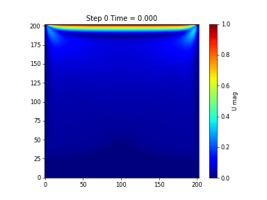
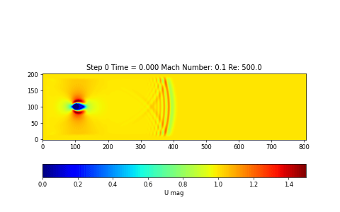
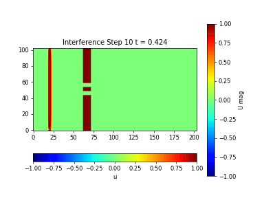

# PDE_Module

Pure python based mesh-based simulation project accelerated by python DSLs such as Numba and Nvidia Warp to accelerate runtimes!

Inspiration is taken from pytorch (namely `torch.nn`) which gave users acess to CUDA accelerated ops but with python's flxeibility ontop to allow for easy setup, analysis and dynamic behaviour of networks that would be difficult/cumbersome to do in lower level languages.

From a high level, simulations turn out to be very similar to Deep Learning networks in that a single iteration can be thought of as a single network composing of many layers (such as laplacian and divergence terms) working together.

# Examples!

<table>
  <tr>
    <td align="center"></td>
    <td align="center"></td>
    <td align="center"></td>
  </tr>
  <tr>
    <td align="center">Transient LDC Re=100</td>
    <td align="center">Transient Cylinder Flow Re=500</td>
    <td align="center">Diffraction With Wave Equation</td>
  </tr>
</table>

## 100%-ish python code

Python is notoriously slow but highly dynamic and easy to setup and use. Most effecient codes require much lower level control and speed such as C++ and Fortran or CUDA. Like Neural networks we might want to have a lot of flexibility in how we combine different pieces/layers but the actual ops need to be fast.

To do this we leverage 2 DSLs (so far):

- [Numba](https://numba.readthedocs.io/en/stable/) for CPU based ops (mainly around meshing)
- [Nvidia Warp](https://github.com/nvidia/warp) for CUDA based kernels mainly for accerlerated stencil compuation

the -ish in the 100% comes from the fact that these DSL convert python code to intermediate languages (like CUDA) but as everything is in python, it is *hopefully* easy for user to change things

Of course there are limitations and headaches with using a DSL (error tracebacks, library limitations etc) but I still think it blends a good balance between ease of writing and performance based code.

## Simulation Availiable
- Finite Difference (Uniform Grid, Symmetric Stencils)
- Lattice Boltzmann

## Features

## Array Input/Output
Stencils behave like pytorch modules: inputs are arrays (and any additional arguments) and outputs are also arrays making it easy to understand behaviour and easy to combine modules together so long as array shapes match. Functional variants of operations are also availiable

## Fixed Output Array
Memory allocation can be costly, so modules by default allocate memory on setup and are fixed. This also makes graph capture much more straight forward.

# License
- AGPL V3
